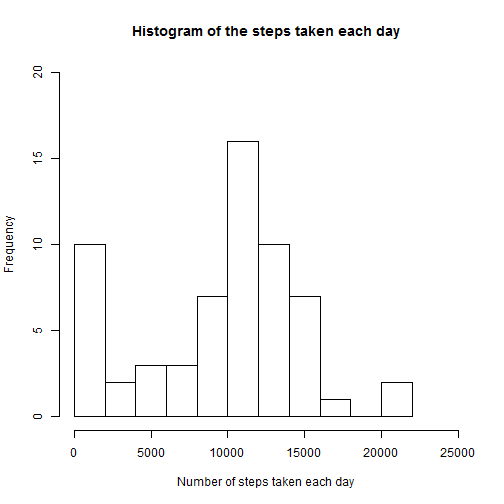
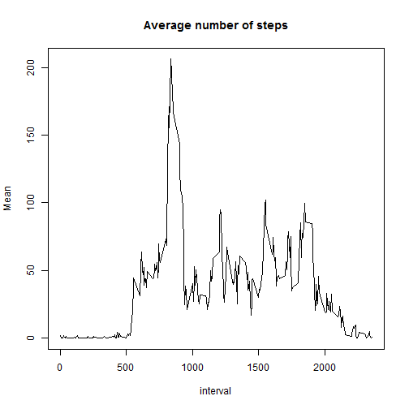
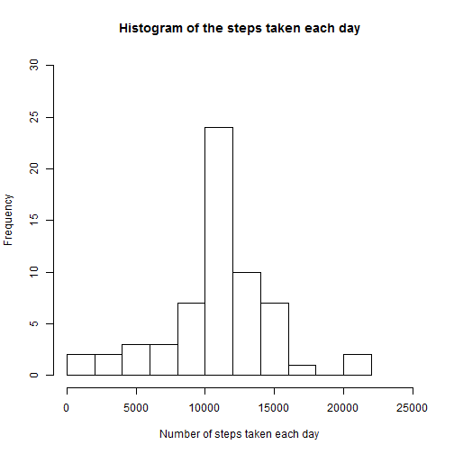
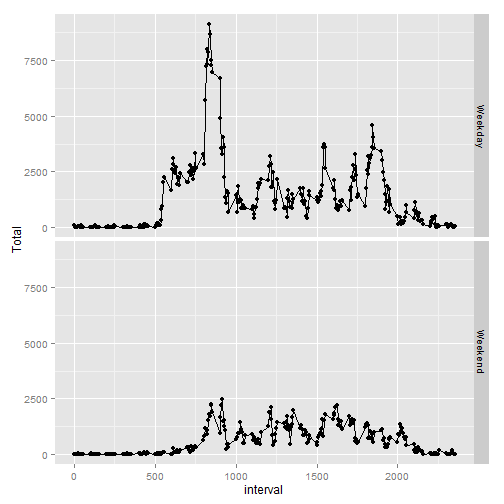

# Reproducible Research (Peer Assessments 1)

## Loading and preprocessing the data

```r
data <- read.csv("./repdata-data-activity/activity.csv", colClasses = c("numeric", "Date", "numeric"))
```

## What is mean total number of steps taken per day?


```r
library(dplyr)
#Add all steps for each day
group_date <- data%>%
     group_by(date)%>%
     summarise(Total = sum(steps, na.rm = TRUE))
#Summarize the results
summary(group_date$Total)
```

```
##    Min. 1st Qu.  Median    Mean 3rd Qu.    Max. 
##       0    6778   10400    9354   12810   21190
```

```r
#Plot the histogram of the total steps
with(group_date, hist(Total, breaks = 10, ylim = c(0,20), xlim = c(0, 25000), main = "Histogram of the steps taken each day", xlab = "Number of steps taken each day"), ylim = c(0,5))
```

 

## What is the average daily activity pattern?


```r
library(dplyr)
#Add all steps for each time interval
group_interval <- data%>%
     group_by(interval)%>%
     summarise(Mean = mean(steps, na.rm = TRUE))
#Plot the time serie
with(group_interval, plot(interval, Mean, 
                type = "l", 
                main = "Average number of steps")) 
```

 

```r
#Print the max number 
max(group_interval$Mean)
```

```
## [1] 206.1698
```

```r
#The coresponding time interval
as.numeric(group_interval[which.max(group_interval$Mean),1])
```

```
## [1] 835
```

## Imputing missing values


```r
#The number of missing values
sum(is.na(data$steps) == TRUE)
```

```
## [1] 2304
```

```r
#Imputed the data with the mean of the interval 
imputed_data <- data %>%
     group_by(interval)%>%
     mutate(steps = ifelse(is.na(steps), 
                          as.integer(mean(steps, na.rm=TRUE)), 
                          steps))

#NO missing values
sum(is.na(imputed_data$steps) == TRUE)
```

```
## [1] 0
```

```r
#Add all steps for each day
group_date <- imputed_data%>%
     group_by(date)%>%
     summarise(Total = sum(steps, na.rm = TRUE))

#Summarize the results
summary(group_date$Total)
```

```
##    Min. 1st Qu.  Median    Mean 3rd Qu.    Max. 
##      41    9819   10640   10750   12810   21190
```

```r
#Plot the new histogram 
with(group_date, hist(Total, breaks = 10, ylim = c(0,30), xlim = c(0, 25000), main = "Histogram of the steps taken each day", xlab = "Number of steps taken each day"), ylim = c(0,5))
```

 

## Are there differences in activity patterns between weekdays and weekends?


```r
library(dplyr)
library(timeDate)
#Add the weekday or Weekend factor
with_weekday <- data%>%
     mutate(Weekday = ifelse(isWeekday(date), "Weekday", "Weekend"))%>%
     group_by(Weekday, interval)%>%
     summarise(Total = sum(steps, na.rm = TRUE))
#Plot the results 
library(ggplot2)
qplot(interval, Total, data = with_weekday, facets = Weekday~ .) + geom_line()
```

 

